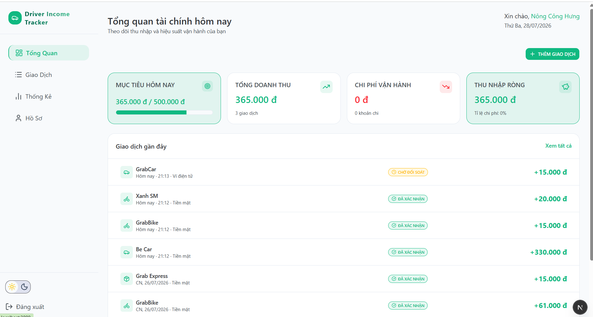
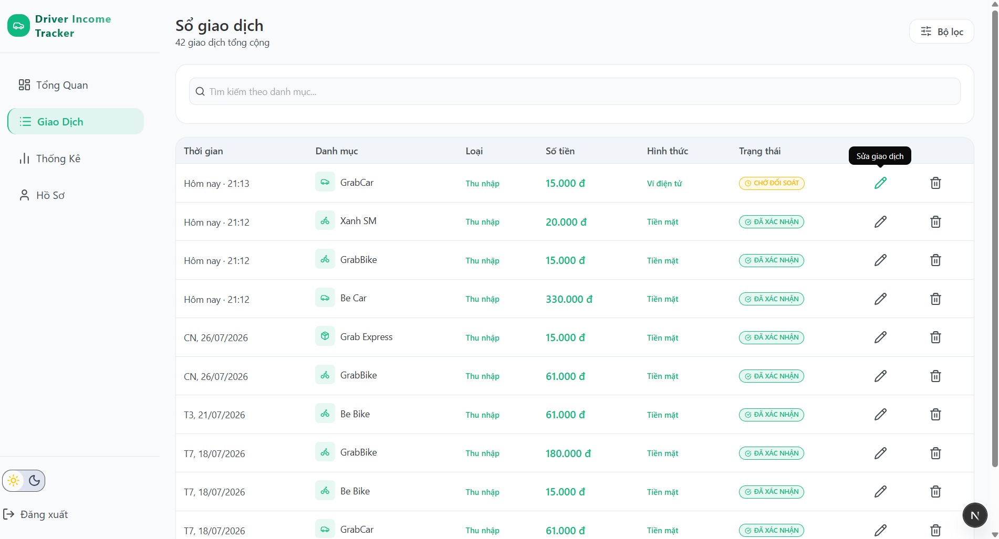
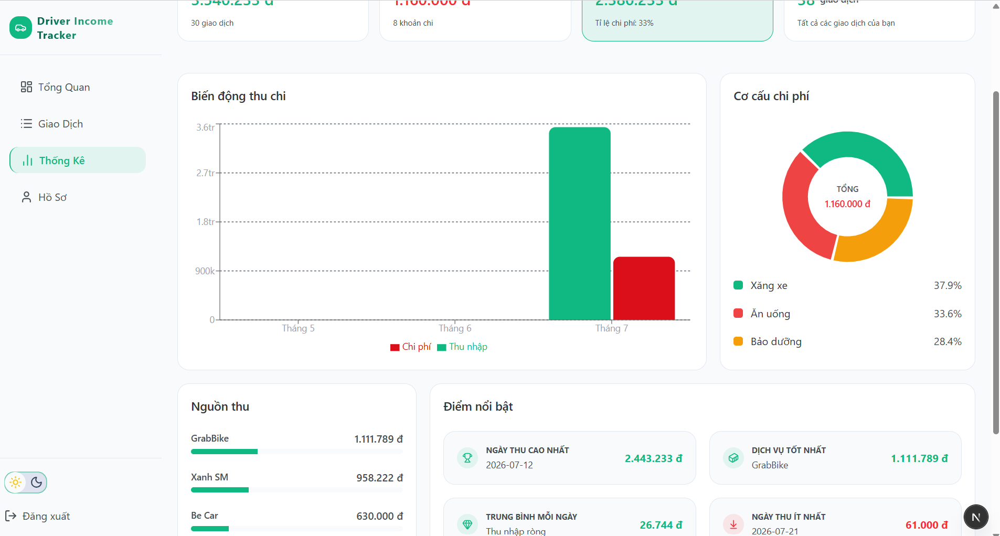
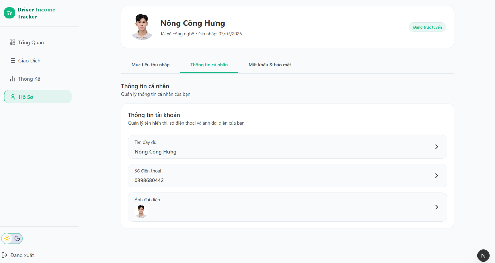
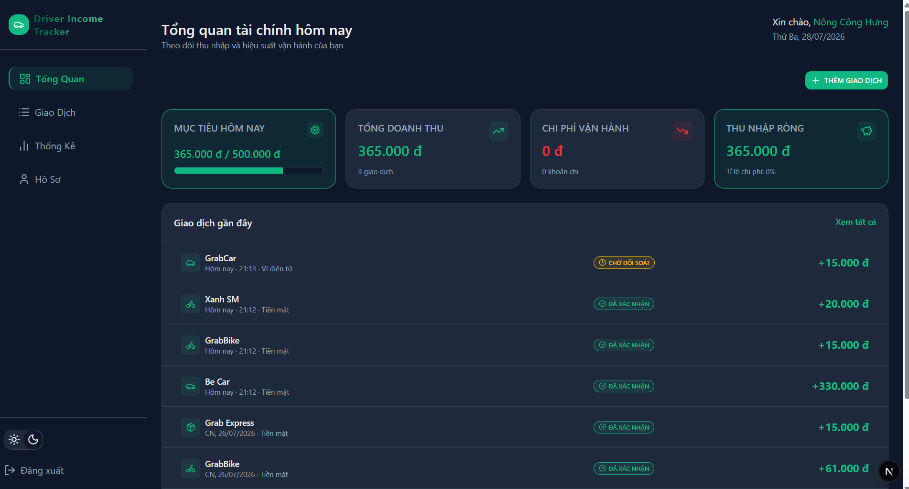
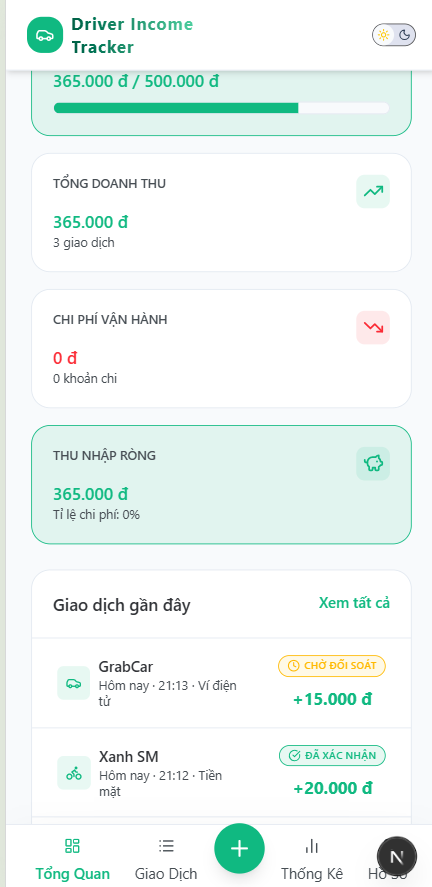

## 🌐 Live Demo

https://driver-income-tracker-snowy.vercel.app/

---

# 🚗 Driver Income Tracker

A full-stack web application that helps ride-hailing drivers manage their income, expenses, financial goals, and business performance through interactive reports and analytics.

---

## ✨ Highlights

- ⚡ Built with **Next.js 16 App Router**
- 🔐 JWT Authentication & Refresh Token
- 📊 Interactive Dashboard with Recharts
- 📈 Financial Reports & Analytics
- 💰 Income & Expense Management
- 🎯 Daily Income Goal Tracking
- ☁️ Cloudinary Image Upload
- 🗄 PostgreSQL Database (Supabase)
- 🧩 Prisma ORM
- ⚛️ TanStack Query for Server State
- 🐻 Zustand for Client State
- 📝 React Hook Form + Zod Validation
- 🌙 Dark / Light Mode
- 📱 Responsive Design

---

# 📸 Screenshots

| Dashboard                                   | Transactions                                      |
| ------------------------------------------- | ------------------------------------------------- |
|  |  |

| Statistic                                   | Profile                                  |
| ------------------------------------------- | ---------------------------------------- |
|  |  |

| Dark Mode                                    | Mobile                                |
| -------------------------------------------- | ------------------------------------- |
|  |  |

---

# ✨ Features

## 🔐 Authentication

- Register
- Login
- Logout
- JWT Authentication
- Refresh Token
- Protected Routes

---

## 💳 Transactions

- Create Transaction
- Update Transaction
- Delete Transaction
- Income / Expense Support
- Filter by Date Range
- Filter by Transaction Type
- Pagination

---

## 📊 Dashboard

- KPI Summary Cards
- Net Income
- Total Income
- Total Expense
- Total Transactions
- Expense Ratio

---

## 📈 Reports

### Dashboard Summary API

- Total Income
- Total Expense
- Net Income
- Expense Ratio
- Best Day
- Worst Day
- Average Daily Income
- Top Income Category

### Revenue Analytics

- Today
- This Week
- This Month
- Last X Months
- Income vs Expense Comparison

### Category Analytics

- Expense Categories
- Income Categories
- Percentage Distribution
- Total Amount by Category

---

## 🎯 Goals

- Set Daily Income Goal
- Update Goal
- View Current Goal
- Progress Tracking

---

## 👤 User Profile

- Update Personal Information
- Change Password
- Upload Avatar
- Preview Avatar Before Upload

---

## 🎨 UI / UX

- Responsive Design
- Dark Mode
- Light Mode
- Toast Notifications
- Tooltip
- Loading States
- Empty States
- Skeleton Loading
- Confirmation Dialogs

---

# 🛠 Tech Stack

## Frontend

- Next.js 16
- React 19
- TypeScript
- Tailwind CSS
- shadcn/ui
- Zustand
- TanStack Query
- React Hook Form
- Zod
- Recharts
- Sonner

---

## Backend

- Next.js Route Handlers
- RESTful APIs
- Prisma ORM
- PostgreSQL
- JWT Authentication
- bcrypt
- Data Aggregation APIs

---

## Services

- Supabase
- Cloudinary
- Vercel

---

# 📂 Project Structure

```text
src
│
├── app
│
├── components
│   ├── common
│   ├── features
│   └── ui
│
├── hooks
│
├── services
│
├── providers
│
├── stores
│
├── lib
│
├── constants
│
├── utils
│
├── generated
│
├── validations
│
└── types
```

---

# 🗄 Database

### Main Models

- User
- Transaction
- Vehicle

### Database

- PostgreSQL (Supabase)

### ORM

- Prisma

---

# 🚀 Installation

Clone repository

```bash
git clone https://github.com/conghung205/driver-income-tracker
```

Move into project

```bash
cd driver-income-tracker
```

Install dependencies

```bash
npm install
```

Create `.env`

```env
DATABASE_URL=

JWT_ACCESS_SECRET=

JWT_REFRESH_SECRET=

NEXT_PUBLIC_CLOUDINARY_CLOUD_NAME=

NEXT_PUBLIC_CLOUDINARY_UPLOAD_PRESET=
```

Generate Prisma Client

```bash
npx prisma generate
```

Push Database Schema

```bash
npx prisma db push
```

Run Development Server

```bash
npm run dev
```

---

# 🌍 Deployment

Frontend

- Vercel

Database

- Supabase

Image Storage

- Cloudinary

---

# 📚 What I Learned

During this project I gained hands-on experience with:

- Building a full-stack application using Next.js App Router
- Designing RESTful APIs
- Structuring scalable React applications
- Database modeling with Prisma
- PostgreSQL deployment using Supabase
- Authentication with JWT & Refresh Token
- State management using Zustand
- Server state management with TanStack Query
- Form validation with React Hook Form & Zod
- Image upload using Cloudinary
- Building responsive dashboards with Recharts
- Creating financial analytics and reporting APIs
- Data aggregation using Prisma Aggregate & GroupBy
- Optimizing reusable components and project architecture
- Deploying a production-ready full-stack application using Vercel

---

# 📄 License

This project was built for learning and portfolio purposes.
